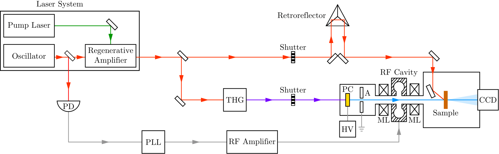
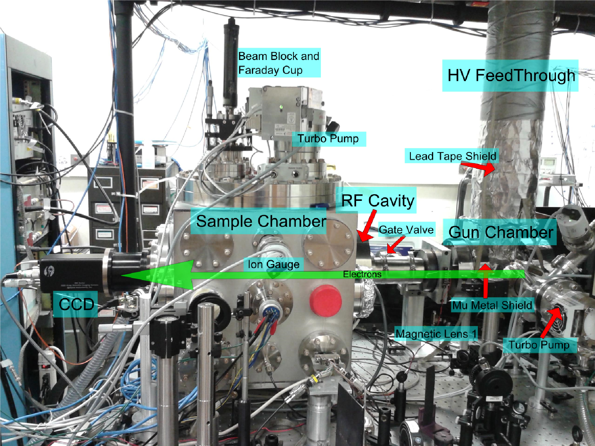
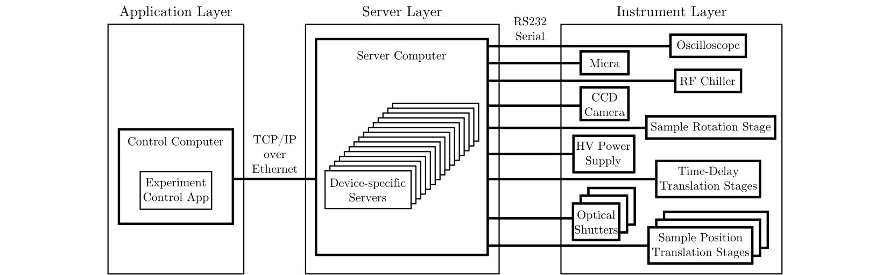
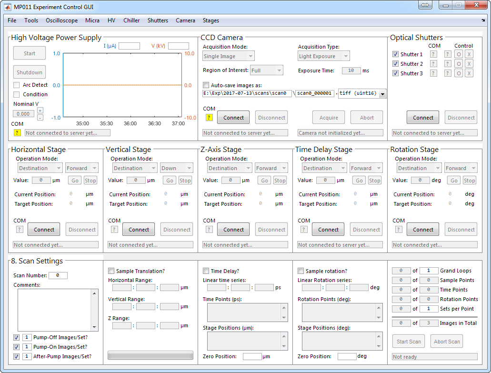

# Standard Operating Procedure for the MP011 Lab

This document roughly describes the operation of the femtosecond laser system and ultrafast electron diffraction (UED) setup of the [R. J. Dwayne Miller group](https://lphys.chem.utoronto.ca) in room MP011 of the [McLennan Physical Laboratories](https://www.physics.utoronto.ca) at the University of Toronto. It was prepared by Drs. [Lai Chung Liu](https://scholar.google.com/citations?hl=en&user=zbmE0IIAAAAJ), [Henrike M. Müller-Werkmeister](https://scholar.google.com/citations?hl=en&user=fA83yPsAAAAJ), and [Yifeng Jiang](https://scholar.google.com/citations?hl=en&user=rJL5HroAAAAJ); last updated in February 2015. Comments may be address by posting in [Issues](https://github.com/liunelson/MP011-SOP/issues) or by contacting Dr. [Samansa Maneshi](mailto:smaneshi@lphys.chem.utoronto.ca) or any of the [current students of the group](https://lphys.chem.utoronto.ca).

## TL;DR

1. Vent the sample vacuum chamber.
2. Measure the pump and probe path lengths.
3. Setup pump laser fluence.
4. Setup pump laser spot size.
5. Install *in situ* streak camera.
6. Install a TEM mesh in the sample holder for pump–probe temporal overlapping.
7. Setup the pump beam for the streak camera.
8. Pump down the sample vacuum chamber.
9. (Cool the sample.)
10. Find the optimal RF power and phase for electron pulse compression.
11. Set pump–probe spatial overlap.
12. Set pump–probe temporal overlap using the mesh signal.

## Table of Content
1. [Overview of the Setup](#overview-of-the-setup)
2. [Startup Guide](#startup-guide)
3. [Experimental Procedures](#experimental-procedures)
4. [Maintenance Steps](#maintenance-procedures)
5. [Troubleshooting Steps](#troubleshooting)

## 1. Overview of the Setup

For reference, the experimental methods section of the theses by [Meng Gao](http://hdl.handle.net/1807/68146), [Hubert Jean-Ruel](http://hdl.handle.net/1807/68134), [Yifeng Jiang](https://pdfs.semanticscholar.org/22bc/a8345a3bf7ba554e03e31d5cd0801e326ba9.pdf), and [Lai Chung Liu](https://1drv.ms/b/s!AsiTQ4FuC9TDhroVUbr-pqiXCgETrg?e=n8JbQh).

### 1.1 Laser System

#### Optical Path

### 1.2 UED Setup

#### Schematic of Vacuum System

### 1.3 Information Technology

#### Internet Router Settings

| Settings | Value |
|:---:|:---:|
| Static IP Address| 128.100.148.66 |
| DNS Addresses	| 128.100.75.10, 128.100.75.99 |
| Gateway Address	| 128.100.148.1 |
| MAC Address	| 00-50-04-A3-6E-AB |
| Subnet Mask	| 255.255.255.0 |

#### DHCP Client List (IP Addresses Reserved)

| IP Address | Device Name	| MAC Address	| Description |
|:---:|:---:|:---:|---|
| 192.168.0.1 |  | 64-70-02-A5-3E-34 | TP-Link wireless router |
| 192.168.0.100 – 192.168.0.199	|  |  | Reserved for wireless devices |
| 192.168.0.200	| Lagavulin	| C0-3F-D5-B3-0C-79	| Main control PC |
| 192.168.0.201	| Talisker | 00-22-14-D4-BD-51	| Server PC |
| 192.168.0.202	| Oban | 00-17-31-24-8E-D2	| Laser monitoring PC | 
| 192.168.0.203	|  | 00-50-C2-29-58-0C	| New Focus ethernet controller (model 8752) for beam-pointing picomotors |

#### Serial Ports on Main Control PC

| Port | Device |
|:---:|---|
| COM1 | Sample x,y,z translation stages (on backend serial port)
| COM6 | Shutter 1 (blue, on P1)
| COM8 | Time delay translation stage (on P5)
| COM9 | RS40 rotation stage (on separate serial-to-USB converter)
| COM10 | Shutter 2 (red, on P2)
| COM12 | Shutter 3 (yellow, on P4)
| COM18 | Electrometer (on P6)
| COM25 | High voltage power supply (on P3)

## 2. Startup Guide

### 2.1 Laser System

- Switch on chillers.
1. Switch on the main power bar and refrigeration of chiller (Neslab RTE-100) for REGEN Pockels cell.
2. Switch on the chiller (Neslab Merlin M25) for REGEN pump laser.
3. Check the REGEN chiller water temperature setting (20 C).
4. Check the Micra chiller status (21 C).
5. Check the CCD camera chiller status (20 C).
6. Check that the water flow rate of the REGEN pockels chiller is about 2.5 gal/min.
7. Check that the water flow rate of the REGEN pump laser chiller is about 10 gal/hr.

- Switch on oscillator.
8. Turn the key (from standby to on) of Micra power supply controller (PSC).
9. Open Micra shutter using Micra PSC.
10. Wait about 5 min.
11. Check for Micra power ~200 mW and Verdi power ~ 4.5 mW on PSC indicator.
12. Enable automodelocking on Micra PSC by pressing `Menu Select` 3 times.
13. Return to original status screen of Micra PSC by pressing `menu exit` 2 times.
14. Wait about 1 min.
15. Check for `automodelocked` status on Micra PSC indicator.
16. Expect Micra power to be about 290 mW.
17. Wake up the Micra Synchro-Lock laptop by pressing its power button.
18. Press `Go Left` or `Go Right` in stepper motor controls to reduce frequency difference.
19. Make sure that `Galvo voltage` is about 0 V and `P/D Det Slave` is greater than 1.0.
20. Enable fundamental and harmonic frequency lock by selecting `fund. enable` and `harm. enable` in Coherent Synchro-Lock program interface; if unable to lock, modify value of `Loop Gain`.

- Switch on ND:YLF pump laser.
22. Switch on power of IntraAction Q-switch driver using back panel push button.
23. Switch on power of Xantrex power supply of Regen pump laser.
24. Set output of Xantrex power supply to 15.3 V and 16.2 A; adjust both voltage and current dials whichever is limiting.

- Switch on and control the REGEN.
25. Switch on power of oscilloscope positioned over REGEN.
26. Slide on power switch of photodiode monitoring REGEN output power.
27. Switch on power and HV on Regen controller (Clark-MXR DT-505).
28. Turn shutter key of REGEN to `on` position.

- Optimize overlap for amplification step by looking at oscilloscope (3 pulses and 4th is coupled out); aim for it to look like entering saturation but not more.
29.	Adjust exit mirror of ND:YLF pump laser to optimize laser output by maximizing 3rd pulse to be slightly less than the 4th pulse on the oscilloscope; rotate oscilloscope 180 deg for convenience.
30.	Adjust exit mirror of oscillator (input into stretcher) to further optimize laser output.

- Measure laser output power.
31.	Use the power meter(Coherent PowerMax, head PM10) to measure output laser power of the compressor (~52 mW at 100 Hz in the current conditions); ensure that power meter is always charged.
32.	Write down Micra power, REGEN pump current, and output power in notebook.

- Turn on control software.
33.	On the Server computer (Talisker): start the beam-pointing camera servers (`PGRFlyCapServer_cam0/1.exe`) in the `laser monitor` directory.
34. On the beam control computer (Oban): start beam-pointing Matlab program `FindBeamWidthInImages.m` in the `C:/BeamMonitor` directory; click `Grab Image`; `Load Settings`, and `Grab Image` again; set `MaxMove` threshold to 1000; enable `Restore H` and `Restore V`; check measured beam position if restored to reference; set `MaxMove` threshold back to 100; click `Start Automatic Grabbing`; enable `Auto H` and `Auto V`; if cameras or mirrors are moved, click `AutoCalibrateMatrix` and wait about 5 min for re-calibration.

### 2.2 Venting Procedure of the Sample Chamber

1. Properly shut off HV power supply, RF compression system, and CCD camera.
2. Close completely the isolation gate valve of the electron gun.
3. Close the roughing pump valve which is located on top of the sample chamber.
4. Press the power button of the turbopump controller to put the turbopump in standby mode.
5. Check actual rotation speed by using the arrow buttons of the turbopump controller and switching to the `act rotspd` channel (309) .
6. Wait about 10 min for turbopump rotation speed to drop from 1000 Hz to 0 Hz.
7. Make sure N₂ cylinder valves are all closed.
8. Use controller arrow buttons to switch to `vent mode` channel (030).
9. Press both arrow buttons simultaneously to change `vent mode` from `1` (vent valve closed) to `2` (vent valve open).
10. Open the valves of the N₂ cylinder.
11. Open slowly regulator valve until air flow reaches about 5 psi.
12. Use a torque wrench to remove some of the screws of the main access flange; expect to hear a hiss caused by positive chamber pressure.
13. Close the valves of the N₂ cylinder.
14. Change turbopump `vent mode` from `2` back to `1`.
15. Remove remaining screws of main flange.

### 2.3 Venting Procedure of the Electron Gun Chamber 
1. Properly shut off HV power supply, RF compression system, and CCD camera.
2. Close completely the isolation gate valve of the electron gun.
3. Close the roughing pump valve which is located on top of the sample chamber.
4. Close the valve of the gun chamber roughing pump located below the gun chamber turbopump by turning the knob until the solid line is horizontal.
5. Press the power button of the sample chamber turbopump controller to put the sample chamber turbopump in standby mode.
6. Press the power button of the gun chamber turbopump controller to put the gun chamber turbopump in standby mode.
7. Wait about 20 min for the rotation speed of both turbopumps rotation to drop to 0 Hz.
8. Wait for both chamber pressures to be between 10⁻³ and 10⁻² mbar.
9. Open completely the isolation gate valve of the electron gun.
10. Wait for the pressure between both chambers to be equalize.

### 2.4 Pump-Down Procedure of the Sample Chamber 
1. Clean the knife edge of the main access flange and the new copper gasket with solvent.
2. Install gasket-flange onto sample chamber.
3. Install screws in their numerical order.
4. Hand-tighten the screws.
5. Check turbopump `vent mode` to be `1`.
6. Open slowly roughing pump valve; expect throttling noise from pump.
7. Wait 15 mins for sample chamber pressure to be about 10 mbar.
8. Switch on the power of the sample chamber turbopump.
9. Check if the chamber pressure drops below 10⁻⁴ mbar before turbopump frequency reaches 1 kHz; troubleshoot otherwise.
10. Wait about 6 hrs for pressure to be less than 10⁻⁷ mbar.
11. Check turbopump motor current as a measure of the efficiency of the roughing pump; 0.50–0.70 A (sample chamber) or 0.20–0.30 A (electron gun chamber).

### 2.5 Start-Up Procedure of the Electron Gun 
1. Make sure that the RF voltage is 0 V by turning the RF power dial clockwise fully.
2. Make sure that the vacuum pressure of the sample chamber is less than 10⁻⁷ mbar.
3. On the control computer (Lagavulin): Start HV control Matlab program (HVControl.m), directory D:/Matlab.Routines/HVControl/, Set `Desired Voltage` to 94.1 kV, Enable `Allow Arc Control?` and `Auto Conditioning`.
4. Switch on the power of PLL chiller (IsoTemp 1016S)
5. Switch on the power of vacuum motors using power bar behind HV power supply
6. Switch on the power and `HV` output of HV power supply
7. On the Server Computer (Talisker), switch on the power of RF cavity chiller (Neslab RTE-7) using `ON` command on chiller server program (`multilogger.bat`) or manual press the power button (works only if the chiller is not computer-controlled; the chiller can be switched off using either the computer or the button).
8. Switch on the power of oscilloscope above PLL.
9. Switch on the power of RF waveform generator (Agilent 33220A).
10. Switch on the power of PLL. 
11. Turn the RF attenuator dial clockwise to set RF voltage to 0.
12. Turn the mains power key of RF amplifier from `0` to `1`.
13. Check that Micra is modelocked.
14. Press `Latch reset` button on the `RF Interlock and Timing` panel to reset the RF interlock.
15. Turn RF attenuator dial such that the *purple* output RF waveform matches the *purple* reference line.
16. Turn `RF OFF` latch button to reset RF interlock.
17. Switch on the power of the CCD camera.
18. Switch on the power of the magnetic lens power supply.

### 2.6 Computer control
- Start the camera software.
1. Start the camera software (SI Image SGL).
2. Select `800-402.set` and click `OK`.
3. Set camera cooler to `ON`.
4. Update date of auto-save directory.
5. In configuration tab, set `Shutter Delay` to `10 ms`.
6. Start TCP/IP server in `Operate` Menu.
- Start the motion control program.
7. Double click and run Motion Control program at `D:\Code\Sample.Motion.Control\Experiment_Control.vbp`.
8. Click `Connect` in the `Camera` menu.
9. Select `ROI` in `SI CCD` subsection.
10. Modify the camera ROI settings appropriately (Serial, SLen, Parallel, PLen): *small ROI* = (950,124,650,200), *medium ROI = (750,324,425,600), *large ROI* = (500,574,200,1000).
- Initialize translation stages.
11.	Click `Initialize` in the `Horizontal (Indexer 1)` subsection.
12.	Set`Operation Mode` to `Destination` and `Reverse` (for the horizontal stage) or `Down` (for the vertical stage); directions of the sample chamber translation stage: `Reverse` = towards the lab door (negative encoder value, right on screen), `Down` = towards the lab floor (positive encoder value, up on screen).
13.	Set both `Destination` values to be `100000`.
14.	Click `Go`.
15.	Wait for `motor idle` status; make sure that the stages do not hit the chamber walls.
16.	Click `Reset` to reset the stage encoders to 0.
17.	Click `Initialize` in the `Stage (Indexer 4)` subsection.

## 3. Experimental Procedure

### 3.1 Check Laser Pulse Compression
1. Manually open the THG shutter (Uniblitz).
2. Put the powermeter head after the last mirror.
3. Disable `Avg` on the powermeter; press `Down` to reduce the indicator range.
4. Rotate the polarizer to maximize photocathode pump power (about 200 uJ).
5. Turn the control dial of the compressor to further maximize pump power (about 600 uJ); this dial changes the stage position of the compressor grating.
6. Manually close the THG shutter.
7. Remove the powermeter head.

### 3.2 Optimize THG Photocathode Overlap
1. Change to *small ROI* using the motion control program.
2. Enable `continuous acquisition` in the camera program.
3. Use the cursor to enclose the electron beam on screen in a red box within the camera program.
4. Adjust the position of the THG focusing lens to find the local symmetric maximum of the electron image mean value.

### 3.3 Measure Electron Number
1. Make sure that camera sensor has not saturated.
2. Start `ElectronBeamCal` in the `Automation` menu of the motion control program.
3. Uncheck `Log result`.
4. Check `Track number` and `Continuous acquire`.
5. In case of error (e.g. Ebeam directory not found), check the date settings in the camera program and restart `ElectronBeamCal`.

### 3.4 Check Spatial Overlap of the Pump and Probe Beams
1. Switch off the output of the magnetic lens power supply.
2. Go to the pinhole position with the motion control program.
3. Change to *small ROI* on the motion control program.
4. Reduce to minimum pump laser power.
5. Change exposure time to *single shot* mode (about 0.005 s at 100 Hz) in the camera program.
6. Uncheck `Background` in `Image Correction/Autocorrection` menu of the camera program.
7. Uncheck `Auto Z-scale` in the camera program.
8. Enable `Continuous acquire` on the camera program.
9. Use `Displacement` mode of the motion control program to get a centered electron beam spot.
10. Set laser repetition rate to 1 kHz (?).
11. Open the *red* and *blue* shutters using the motion control program.
12. Align the sample chamber camera, next to the main CCD camera, to get a good view of the pump laser beam spot.
13. Adjust the lens at the pump laser window to optimize the laser spot brightness.
14. Close *red* and *blue* shutters using the motion control program.
15. Return the laser repetition rate to the previous setting (?).

To-do: Describe what each channel (A,B, etc.) on the pulse generator (Quantum Composers 9520 Series) means.

## 4. Maintenance Steps

- Chillers: Water needs to be changed; add anti-algae product. Every 6 months, currently set for February and August.
- Big Thermo Fischer chiller: Change filter every 3–4 years, depending on the chiller flow rate (2–3 gal/min).
- High voltage power supply: Replace insulating oil every 2 years.
- Vacuum pumps: Change oil as needed or whenever the turbopump current is not ok; roughing pumps currently ok.
- Laser system: Clean the oscillator if modelocking is off or power is too low; clean the mirrors for the pump light in the REGEN every 2–4 weeks.
- Chemicals: Dispose of bin contents whenever full (7th floor of the Lash Miller building).

## 5. Troubleshooting Steps

| Problem | Solution |
| ------------- |---------------|
| REGEN output peak selection is suboptimal | Press and check contacts of the `delay 3` control dial of Pockels cell controller | 
| Artifacts (checkered streaks) on acquired CCD image | Restart camera controller and maybe the laser system |
| PP30 stages unresponsive to control program | Restart PP30 power bar |
| Sample stage unresponsive to control program | 'Jiggle' gently the cables of the Parker sample stage controllers |
| Frequent arcing in the electron gun chamber | Carefully recondition the chamber using a low voltage ramp rate |
| Beam-pointing program unresponsive | Restart MATLAB |
